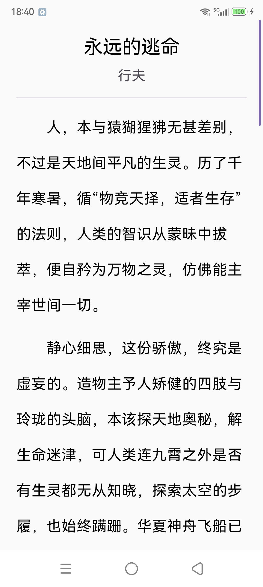
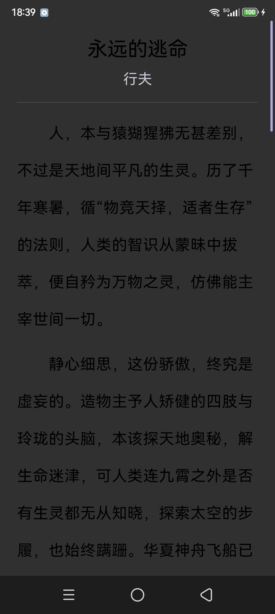

# 每日一文

每天一篇好文章，读完换一篇。极简阅读 App：全屏只有正文，读到文末才有一个按钮。

| 浅色 | 深色 |
|---|---|
|  |  |

## 功能

- **每天一篇**：同一天打开永远是同一篇
- **随机换文**：读到文末点「读完了，随机一篇」；换文时老文章保留可读，顶部只露细进度条
- **离线可读**：每日文章与上次在读自动缓存，全链失败也有兜底，永不白屏
- **返回键退出只清阅读进度**：文章保留，下次从顶部开始；划掉后台则恢复原位置
- 右侧阅读进度条（长度恒定不跳变），正文长按可复制
- 深色 / 浅色跟随系统（Android 12+ 动态取色），字号跟随系统

## 数据源

独立域名故障转移，首个成功者胜出；抓到页面但正文为空也算失败，自动降级：

`读书网 → 散文网 → 短文学 → ONE·一个 → 知乎日报 → 古诗文 → 60秒简报 → 一言短句`

| 源 | 内容 |
|---|---|
| dushu.com | 读书网·每日一读（散文主源） |
| sanwenwang.com | 散文网（散文 / 随笔 / 杂文） |
| duwenzhang.com | 短文学（GBK 编码自适应解码） |
| v3.wufazhuce.com:8000 | ONE·一个（官方 JSON） |
| news-at.zhihu.com | 知乎日报（公开 JSON） |
| gushiwen.cn | 古诗文（每日一诗） |
| 60s.viki.moe | 每日 60 秒简报 |
| v1.hitokoto.cn | 一言短句（最终保底） |

## 构建

环境：Android Studio、JDK 17、minSdk 26。

```bash
./gradlew :app:assembleDebug
```

release 签名通过根目录 `key.properties` 配置（已 gitignore，不入库，需自配，参见 `app/build.gradle.kts`）。

## 结构

```
app/src/main/java/com/deatrg/dailyarticle/
├── MainActivity.kt          # 入口 + 动态取色主题 + HTTP 缓存
├── DailyScreen.kt           # Compose 阅读页（进度条 / 全文选择 / 返回键）
├── ArticleViewModel.kt      # 状态机 + 缓存逻辑 + SourceChain 组装
└── data/
    ├── Models.kt            # Block / Article
    ├── Http.kt              # HttpURLConnection 封装（gzip、桌面/移动 UA、编码自适应）
    ├── ArticleSource.kt     # 数据源接口 + 故障转移链
    ├── ArticleStore.kt      # SharedPreferences 双缓存 + 阅读位置
    ├── DushuSource.kt       # 读书网
    ├── SanwenwangSource.kt  # 散文网
    ├── DuwenzhangSource.kt  # 短文学
    ├── OneSource.kt         # ONE·一个
    ├── ZhihuSource.kt       # 知乎日报
    ├── GushiwenSource.kt    # 古诗文
    ├── SeventySecondsSource.kt  # 60 秒简报
    └── HitokotoSource.kt    # 一言
```

## 实现要点

- 加新源 = 加一个 `ArticleSource` 实现类，不改 ViewModel。
- 散文网、古诗文必须用桌面 UA：移动 UA 会被 302 到移动站 / 只回占位页（真机实测）。
- 每日取 `dayOfYear % 池大小`，保证同一天稳定同一篇文章。
